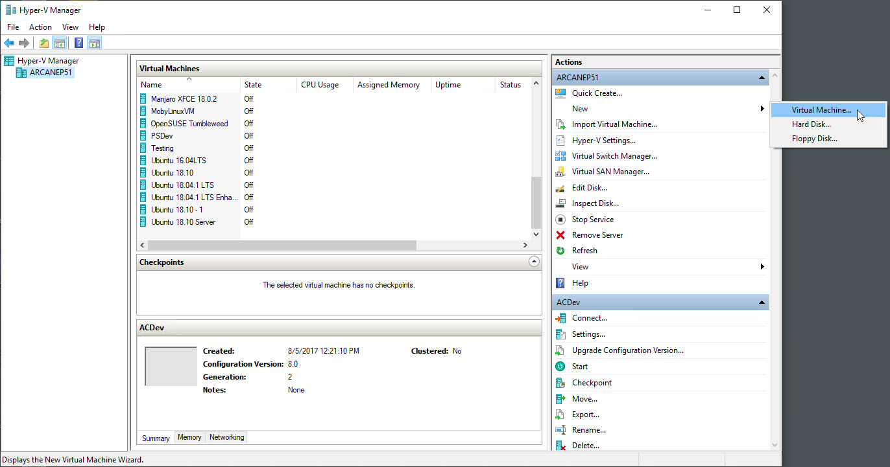
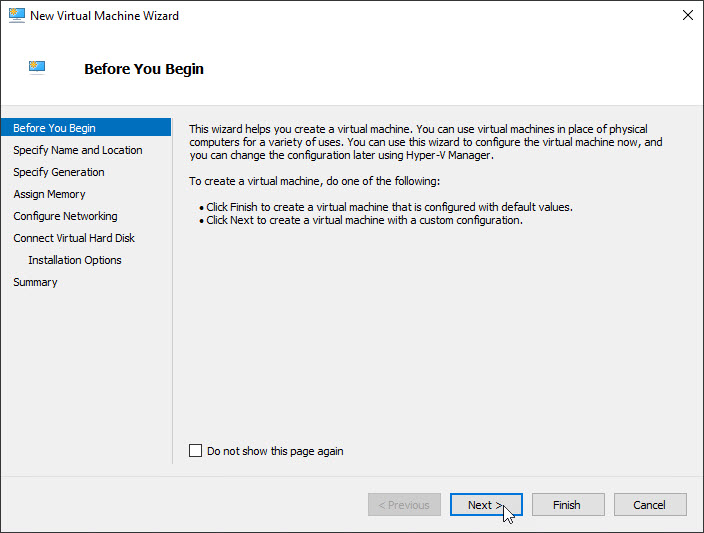
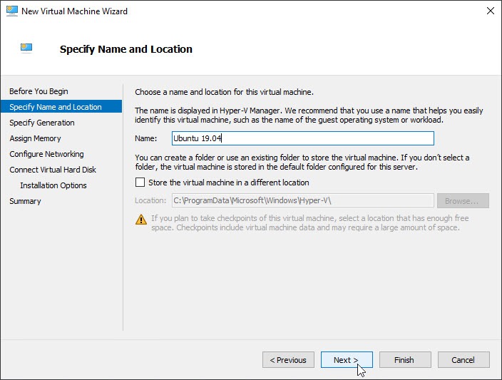
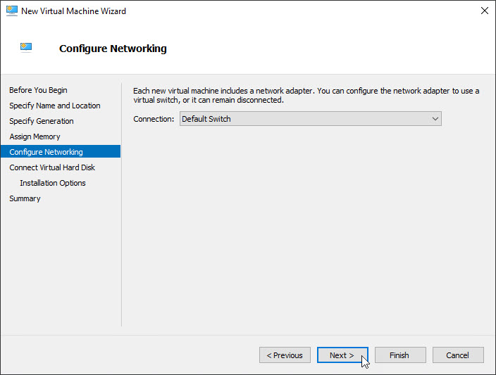
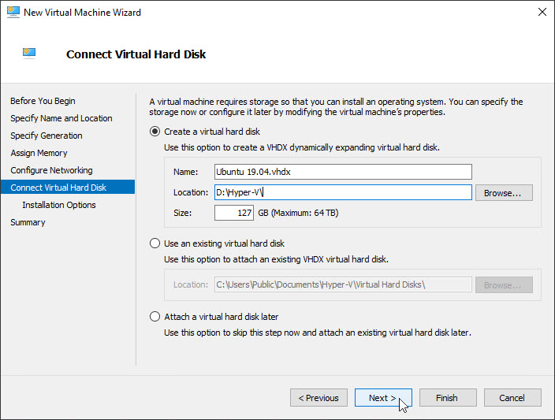
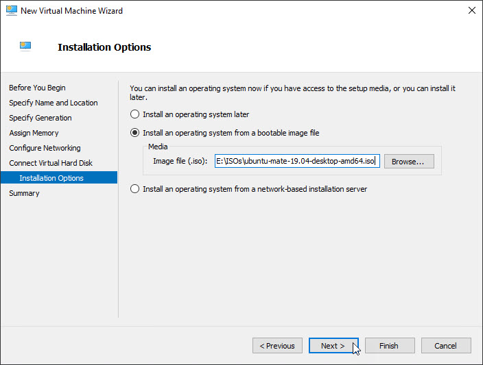
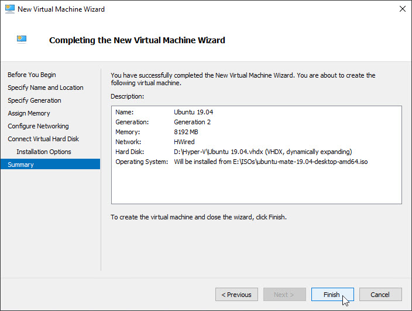
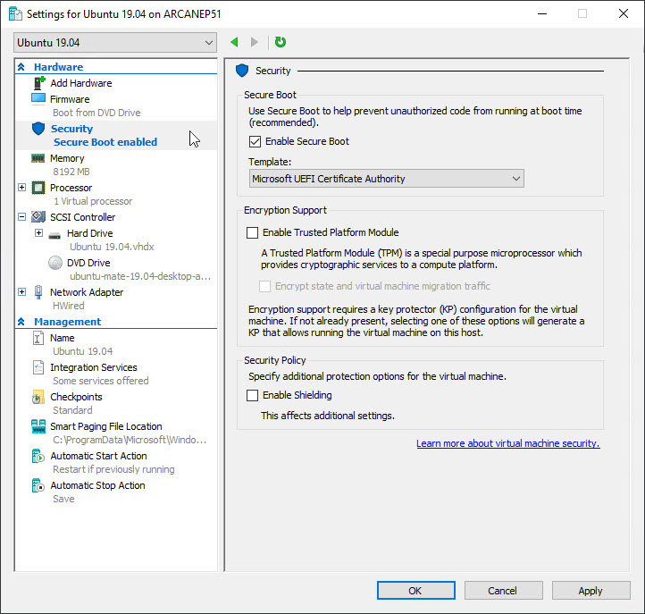
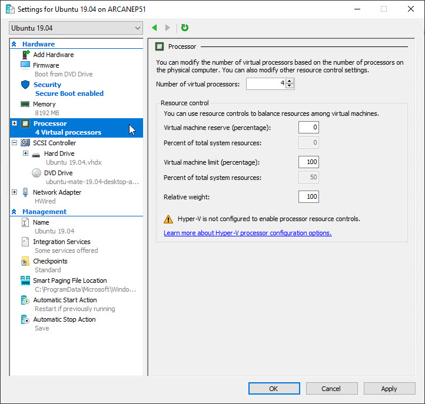
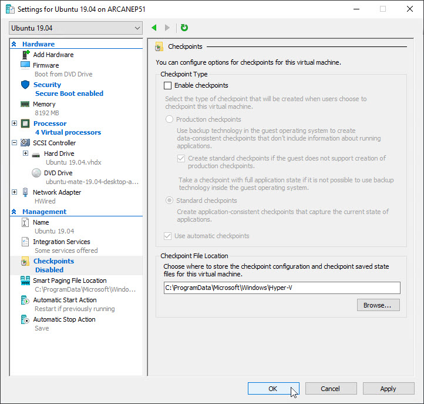

# Creating an Ubuntu VM in Hyper-V

In this tutorial we'll see how to install Ubuntu in a Microsoft Hyper-V virtual machine. In the tutorial, we'll use Ubuntu 19.04, but the steps work with most any version of Linux. 

## Prerequisites
For this demo we are using Windows 10 Pro. Before you can use Hyper-V, you need to make sure it is activated in the Windows features. 

Click on the Start menu, then click on the gear to bring up Windows Settings. Then select _Apps_. In the _Apps & features_ look to the right and click on _Programs and Features_. 

When the dialog appears, click on _Turn Windows features on or off_. In the Windows Featues dialog, put a check next to Hyper-V, then click the OK button. Confirm your choices, then (if needed) reboot. 

## Create the VM

Start by opening the Hyper-V manager. (Start, Windows Administrative Tools, Hyper-V Manager) Over on the right click on New, then Virtual Machine.



The first screen in the wizard is just a welcoming screen. You can, if you want, click on the _Do not show this page again_ check box so in the future you won't have to see it. Click Next. 



Next, you'll be prompted to give the VM a name. This is the name that will appear in the list of VMs. 

Also note the option to store the VM in a different location. This location is used for the VM information, but not for the virtual hard drive. We'll set that location in a bit. 

Enter a good name that describes the VM, then click Next.



In the next screen you specify the generation for the virtual machine. Newer versions of Linux support Generation 2, so change the generation to 2 and click next. (If you experience problems you can try again later with Genereation 1.)


On the next screen you assign the amount of memory you want the machine to have. By default it is set to 1 gig, or 1024 MB. You should, at the very minimum, up this to 2 gig (2048 MB), but 4 gig (4096 MB) is preferable. If you are going to experiment with Docker (as we'll do in the PowerShell Core for Linux and macOS course) then up it to 8 gig (8192 MB). (If you have a lot of ram then you can try 16,384 MB, or 16 gig).


Next, you are ask to configure your network connection. The _Default Switch_ option will use the same network connection as the host machine. If you've setup a different network connection you can of course use it. 



On the next screen you are asked about the virtual hard disk, or VHD, you want to use for the virtual machine. We'll create a new one for this exercise. 

On this creation I've opted to store the new VHD on a different drive on the host machine (the Windows 10 box). 

As a last step you can resize the virtual hard drive if you want. This is the size the drive will expand to, not the size of the drive initially. For a simple VM you could easily reduce this to 50 gig, but leaving it at 127 won't create any problems as it will only grow to that size if it needs to. 



On the next tab we can indicate we want to install a new operating system, and where the source ISO is. 

Change the option to _Install an operating system from a bootable image file_, then click the Browse button to find the ISO file. 

When you've picked it, click Next.



The last page is the summary page. Just click next to create the new VM.



## But wait, there's more!

You may be tempted to start up the virtual machine, but **don't**! 

Back in the Hyper-V manager, find the new VM. Right click, and pick _Settings_. 

In the window that appears, start by clicking on Security. Naturally Ubuntu doesn't support Windows Windows boot security, instead change it to Microsoft UEFI Certificate Authority. 



Next, click on the option for Processor. By default it only provides for 1 virtual processor. Most machines can provide more than this, so at least increase to 2, 4 would be preferable for a development / learning VM. 



Next click on Checkpoints. This is a personal choice, but I don't care much for Checkpoints so I'm going to uncheck the _Enable checkpoints_ option. 



With these choices done, click OK.

## Install Ubuntu

Back in the Hyper-V Manager, just right click on the row with your new Virtual Machine and click Start. 

When the VM launches, with Ubuntu it will be in "Live" mode. You can experiment with the machine. When ready you can lick install to install it. 

From there just follow the prompts like you would any Ubuntu installation. 

# Last Configuration Step

As a last step, you may want to set the screen resolution. When installing Ubuntu in a Hyper-V VM the resolution doesn't resize automatically, and getting the tools right can be a troublesome endevour. 

If screen resolution is the only thing that needs to be fixed, it's far easier just to edit the default resolution in the Ubuntu configuration. Use the following steps to make your Ubuntu VM just the right size.

Inside Ubuntu:

1. Open a terminal window
2. sudio vi /etc/default/grub
3. Find the line starting with GRUB_CMDLINE_LINUX_DEFAULT
4. Append video=hyperv_fb:1280x720 (or 1920x1080, or 2560x1440, etc) so it looks like:
```bash
GRUB_CMDLINE_LINUX_DEFAULT="quiet splash video=hyperv_fb:1280x720"
```
5. Write changes with ESC :wq
6. Update grub by running the following command:
```bash
sudo update-grub
```
7. Finally, reboot your VM. You can use the GUI, or issue the following command in the terminal:
```bash
sudo /sbin/shutdown -r now 
```

Boom, enjoy the new resolution.

Source: https://metinsaylan.com/8991/how-to-change-screen-resolution-on-ubuntu-18-04-in-hyper-v/

## Last notes

Ubuntu in the VM doesn't always restart correctly, instead you should probably do a shut down and then start.
